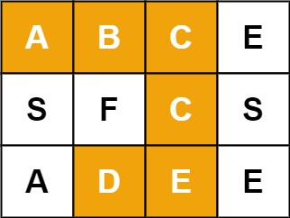

# 79. Word Search

Given an m x n grid of characters board and a string word, return true if word exists in the grid.

The word can be constructed from letters of sequentially adjacent cells, where adjacent cells are horizontally or vertically neighboring. The same letter cell may not be used more than once.

### Example 1:



```
Input: board = [["A","B","C","E"],["S","F","C","S"],["A","D","E","E"]], word = "ABCCED"
Output: true
```

### Example 2:


```
Input: board = [["A","B","C","E"],["S","F","C","S"],["A","D","E","E"]], word = "SEE"
Output: true
```

### Example 3:


```
Input: board = [["A","B","C","E"],["S","F","C","S"],["A","D","E","E"]], word = "ABCB"
Output: false
```

### Constraints:

* m == board.length
* n = board[i].length
* 1 <= m, n <= 6
* 1 <= word.length <= 15
* board and word consists of only lowercase and uppercase English letters.

### Follow up: 

Could you use search pruning to make your solution faster with a larger board?

### Translate:

> 79. 单词搜索
> 
> 给定一个m x n 二维字符网格board 和一个字符串单词word 。如果word 存在于网格中，返回 true ；否则，返回 false 。
>
> 单词必须按照字母顺序，通过相邻的单元格内的字母构成，其中“相邻”单元格是那些水平相邻或垂直相邻的单元格。同一个单元格内的字母不允许被重复使用。
> 
> 进阶：你可以使用搜索剪枝的技术来优化解决方案，使其在 board 更大的情况下可以更快解决问题？


### 解题思路
当格子使用后，赋值'-'，判断结束后，需要还原成之前的字母

### 代码

```golang
func exist(board [][]byte, word string) bool {
	for i := 0; i < len(board); i++ {
		for j := 0; j < len(board[i]); j++ {
			if board[i][j] == word[0] {
				result := dfs(board, word, i, j, 0)
				if result {
					return true
				}
			}
		}
	}
	return false
}

func dfs(board [][]byte, word string, rowIndex, colIndex int, depth int) bool {
	if board[rowIndex][colIndex] != word[depth] || board[rowIndex][colIndex] == '-' {
		return false
	}
	if depth == len(word)-1 {
		return true
	}
	current := board[rowIndex][colIndex]
	board[rowIndex][colIndex] = '-'
	depth++
	if rowIndex > 0 && dfs(board, word, rowIndex-1, colIndex, depth) {
		return true
	}
	if rowIndex < len(board)-1 && dfs(board, word, rowIndex+1, colIndex, depth) {
		return true
	}
	if colIndex > 0 && dfs(board, word, rowIndex, colIndex-1, depth) {
		return true
	}
	if colIndex < len(board[0])-1 && dfs(board, word, rowIndex, colIndex+1, depth) {
		return true
	}
	board[rowIndex][colIndex] = current
	return false
}
```